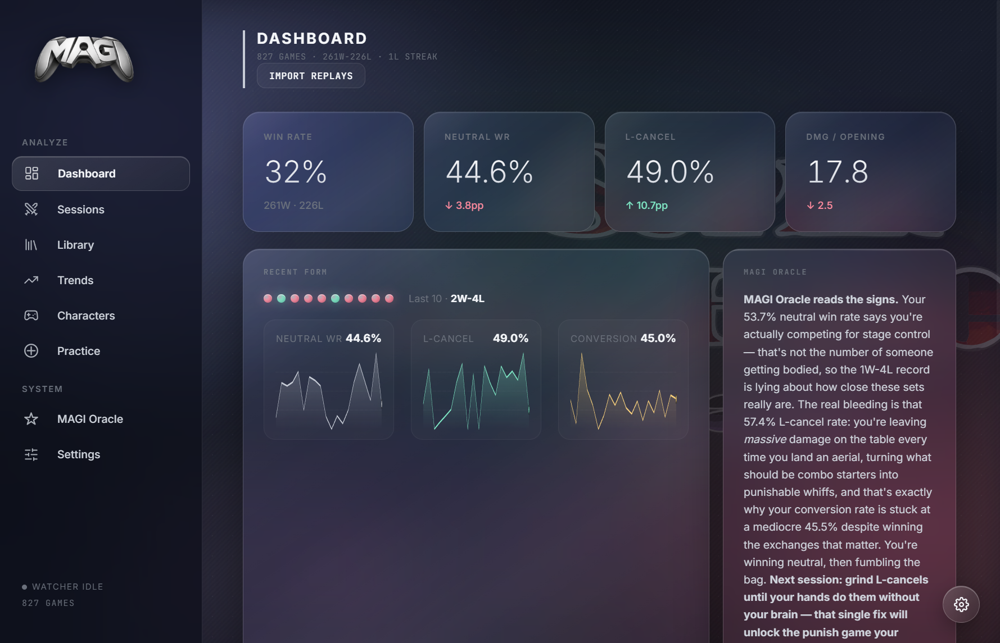
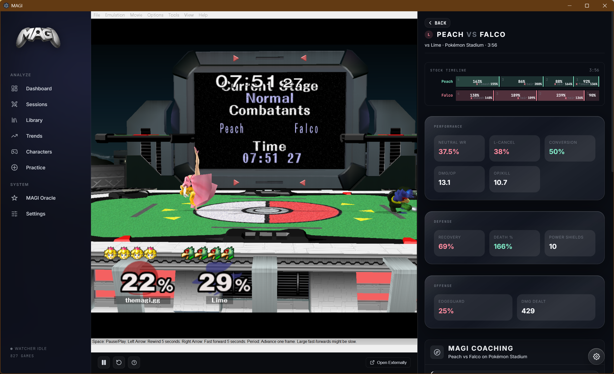
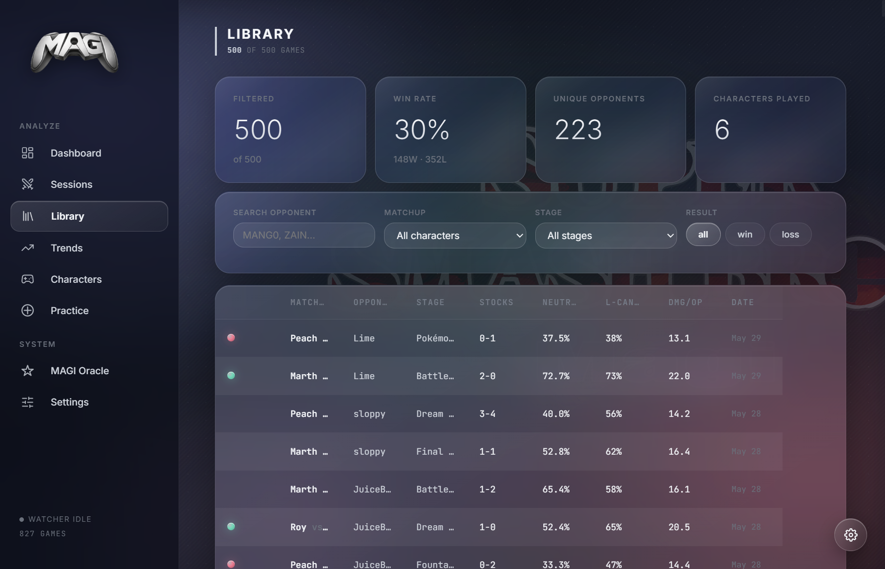
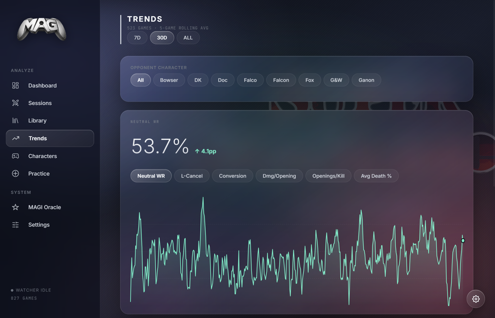
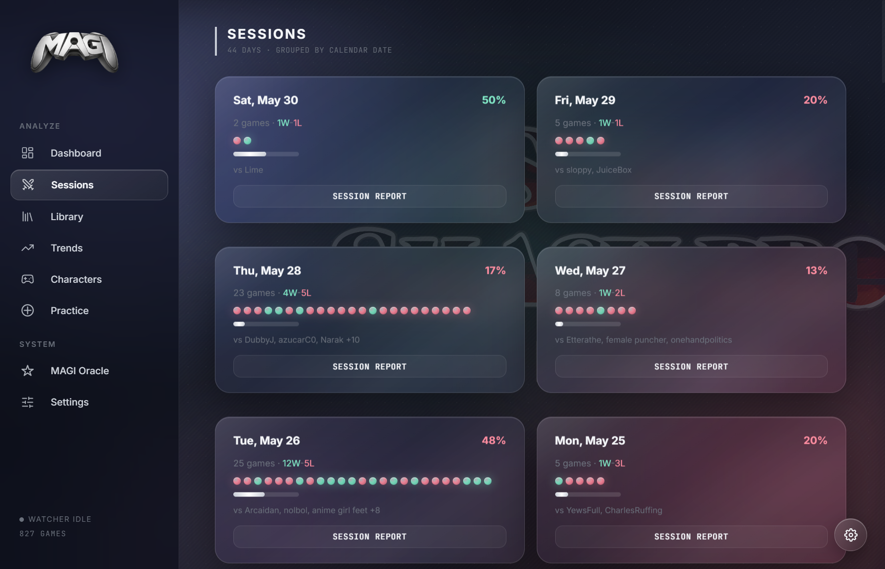
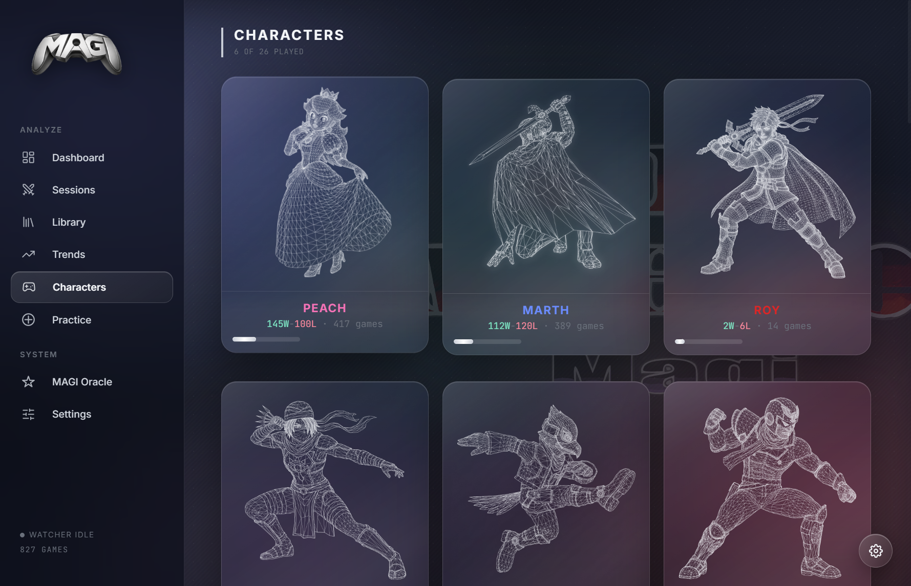
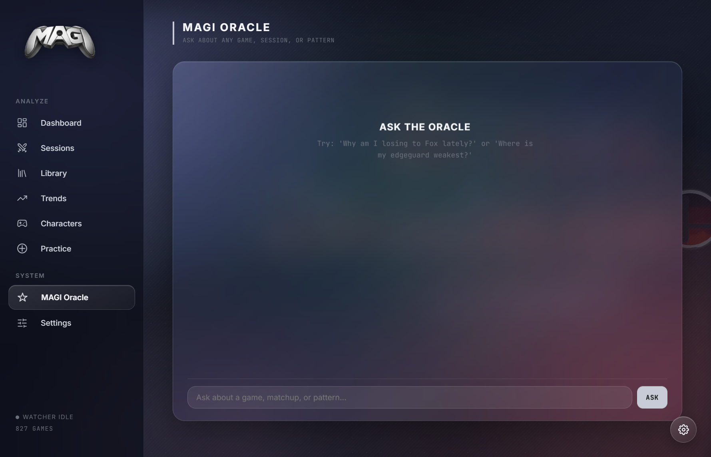
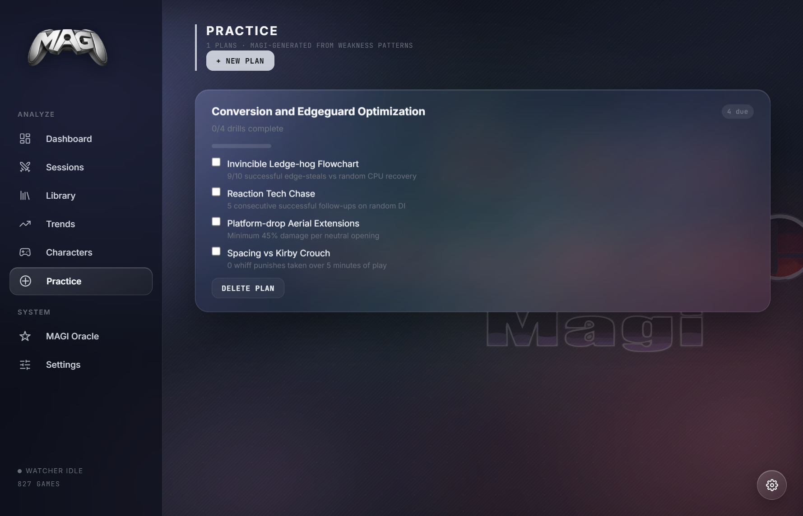

# MAGI

Melee Analysis through Generative Intelligence.

MAGI is a local-first Electron app for turning Slippi `.slp` replays into a searchable Melee performance database, current-form dashboard, AI coaching surface, practice-plan tracker, and replay review workspace.



## Current State

MAGI is currently a Vite + React desktop app with an Electron main process, typed preload bridge, SQLite storage, Slippi replay parsing, multi-provider LLM support, and a redesigned Liquid Metal UI. The active app surface includes:

- **Dashboard** - record, recent form, rolling stat cards, recent games, and an Oracle summary of your latest games.
- **Library** - filter up to 500 recent games by opponent search, matchup, stage, and result.
- **Trends** - 5-game rolling averages for neutral win rate, L-cancel rate, conversion, damage/opening, openings/kill, and average death percent.
- **Sessions** - calendar-day session cards with win/loss dots, opponent summaries, and cached AI session reports.
- **Characters** - 26-character roster view with character art, played-character records, matchup tables, signature stats, and character-scope coaching.
- **Game Theater** - per-game review route with a Windows-only in-app replay viewer, external Dolphin fallback on other platforms, stock timeline, game stats, and inline MAGI coaching.
- **Practice** - generated drill plans based on detected weakness patterns, with drill completion tracking.
- **MAGI Oracle** - persistent chat that answers questions from recent local game context.
- **Settings** - player profile, replay folder import, watcher controls, Slippi Dolphin paths, provider setup, themes, density, and data reset.

## Screenshots















## What MAGI Tracks

MAGI imports Slippi games into a local SQLite database and computes replay-derived stats including:

- result, stage, duration, stocks, characters, opponent tag, and connect code
- neutral wins/losses and neutral win rate
- L-cancel rate, wavedashes, dash-dance frames, platform time, air time, and ledge time
- openings, conversions, damage per opening, openings per kill, and kill conversions
- recovery attempts and recovery success rate
- edgeguard attempts and edgeguard success rate
- shield pressure, shield breaks, shield poke rate, and powershields
- DI survival and combo-quality estimates
- habit entropy for ledge, knockdown, shield pressure, and related decision patterns
- character-specific signature stats stored per game
- highlights such as high-damage conversions, spike kills, 0-to-deaths, and notable stock events

## AI Coaching

MAGI supports both no-key and bring-your-own-key workflows:

- **Pollinations** is available as a free no-key fallback.
- **OpenAI**, **OpenRouter**, **Anthropic**, and **Google Gemini** can be configured in Settings.
- **Local OpenAI-compatible models** can be used through Ollama or LM Studio.
- Model selection is provider-aware, and Settings can fetch model lists for configured providers.
- Analysis calls are queued, streamed into the UI, retried on transient failures, and cached locally when possible.

Coaching currently appears in the dashboard Oracle summary, game theater coaching panel, character-scope analysis modal, daily session reports, generated practice plans, and the Oracle chat.

## Replay Review

MAGI can launch Slippi Dolphin from stored replay paths and jump to specific frames from timestamps.

The in-app replay viewer shown in the screenshots is Windows-only. On Windows, MAGI can position Slippi Dolphin inside the Game Theater route so the replay, stock timeline, stats, and coaching live in one review workspace. On macOS and Linux, replay review uses the external Dolphin launch path when configured; those platforms do not embed the replay surface inside the MAGI window.

Settings accepts optional paths for the Slippi Dolphin executable and Melee ISO. Replay files stay on your machine.

## Local Data And Security

- Database: `~/.magi-melee/magi.db`
- Config: `~/.magi-melee/config.json`
- Development env keys: `key.env` copied from `.env.example`

MAGI does not require an account or a MAGI-hosted backend. API keys are either entered locally in Settings or loaded from local environment files during development. Do not commit `key.env`, local replay data, or personal database files.

## Install

Download builds from the [Releases](https://github.com/Bloodshed-Rain/TheMAGI/releases) page:

- Windows: installer `.exe` or portable `.exe`
- macOS: `.dmg`
- Linux: `.AppImage` or `.deb`

## Development

Requires Node.js 18+.

```bash
git clone https://github.com/Bloodshed-Rain/TheMAGI.git
cd TheMAGI
npm install
```

Useful commands:

```bash
npm run dev          # Vite renderer + compiled main/preload + Electron
npm run build        # TypeScript + Vite + electron-builder package
npm run build:win    # Windows package
npm run build:mac    # macOS package
npm run build:linux  # Linux package
npm test             # Vitest once
npm run test:watch   # Vitest watch mode
npm run lint         # ESLint over src/
npm run format       # Prettier over src/**/*.{ts,tsx}
```

For AI features in development, copy `.env.example` to `key.env` and fill only the providers you use:

```bash
OPENAI_API_KEY=
OPENROUTER_API_KEY=
ANTHROPIC_API_KEY=
GEMINI_API_KEY=
```

The same keys can be entered through Settings in the app.

## Optional CLI Workflows

```bash
# Analyze a single replay
npx tsx src/pipeline-cli.ts path/to/game.slp --target YourTag

# Watch for new replays
npx tsx src/watcher.ts /path/to/replays --target YourTag
```

## Architecture

```text
.slp replays
  -> Slippi parser / parse workers
  -> derived stats, signature stats, highlights
  -> SQLite database in ~/.magi-melee
  -> React UI queries through Electron IPC
  -> queued LLM analysis, streaming, and cached reports
```

Key areas:

- `src/main/` - Electron main process, IPC registration, native replay embedding, updater, dialogs, config, watcher, import, stats, LLM, and Dolphin handlers.
- `src/preload/` - typed `window.clippi` bridge exposed to the renderer.
- `src/renderer/` - Vite + React app, routes, shared components, stores, hooks, themes, and styles.
- `src/pipeline/` - Slippi processing, derived insights, character data, signature stats, highlights, prompt assembly, and player summaries.
- `src/db.ts` - SQLite schema, migrations, inserts, queries, Oracle messages, practice plans, session reports, and trend data.
- `tests/` - Vitest coverage for config, database behavior, importer, pipeline, filters, navigation consistency, stores, sparklines, replay-player state, and themes.

## Current Boundaries

- The redesigned screenshots intentionally omit Settings so local API keys or paths are not exposed.
- The in-app replay viewer is Windows-only. Non-Windows platforms use external Dolphin launch behavior when replay paths and Dolphin settings are configured.
- Pollinations provides a no-key fallback, but paid or self-hosted providers are still the more controllable path for serious usage.
- The website and README describe the current app surface, not a hosted service. MAGI is still a local desktop app.

## License

[MIT](LICENSE)
